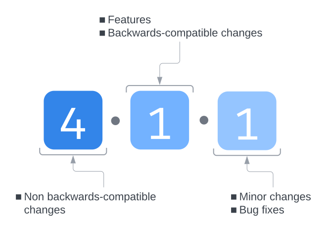

# Introduction

Welcome to the developer documentation for the Tableau Migration SDK. The Migration SDK is primarily written in C# using the [.NET](https://dotnet.microsoft.com/en-us/learn/dotnet/what-is-dotnet-framework) Framework. It includes a [Python API](~/api-python/index.md) to enable interoperability with Python.

## Supported languages

You can develop your migration application using one of the supported languages

- [Python](https://www.python.org/)
- C# using the [.NET Framework](https://dotnet.microsoft.com/en-us/learn/dotnet/what-is-dotnet-framework)

## Versioning

The Migration SDK uses [semantic versioning](https://semver.org).

{width=40%}

## Prerequisites

To develop your application using the [Migration SDK](https://github.com/tableau/tableau-migration-sdk), you should

- Understand framework and language concepts for one of the languages the SDK supports.
- Be able to design and write applications in one of the supported languages.
- Understand how to import and use third party packages
- Understand logging and general troubleshooting of applications.

## Quick Start

- Install a [.NET Runtime](https://dotnet.microsoft.com/en-us/download).
- Install the Migration SDK

### [Python](#tab/Python)

Install using PIP

- [PIP CLI](https://pip.pypa.io/en/stable/cli/pip_install): `pip install tableau_migration`

### [C#](#tab/CSharp)
  
Install using NuGet

- [dotnet CLI](https://learn.microsoft.com/en-us/nuget/quickstart/install-and-use-a-package-using-the-dotnet-cli): `dotnet add package Tableau.Migration`
- [Nuget Package Manager](https://learn.microsoft.com/en-us/nuget/quickstart/install-and-use-a-package-in-visual-studio): Search for `Tableau.Migration`.

---

- Use the sample code in [Example startup code](#example-startup-code) to get started.
- Use the [Resource](#resources) sections to further customize your application.

## Example startup code

The following code samples are for writing a simple migration app using the Migration SDK. For details on configuring and customizing the Migration SDK to your specific needs, see the other articles and [Code Samples](~/samples/index.md).

### [Python](#tab/Python)

[!include]

### [C#](#tab/CSharp)

[!include]

---

## Resources

- [Python API Reference](~/api-python/index.md) : Getting started sample and the complete Python API Reference for comprehensive documentation.
- [C# API Reference](~/api-csharp/index.md): Getting started sample and the complete C# API Reference for detailed documentation.
- [Code Samples](~/samples/index.md): Code samples to kickstart your development process.

## Source Code

The Tableau Migration SDK is open source. The source code is in our [GitHub repo](https://github.com/tableau/tableau-migration-sdk).

## Contributing

Refer to this handy [contribution guide](https://github.com/tableau/tableau-migration-sdk/blob/main/CONTRIBUTING.md) if you would like to contribute to the Migration SDK.
